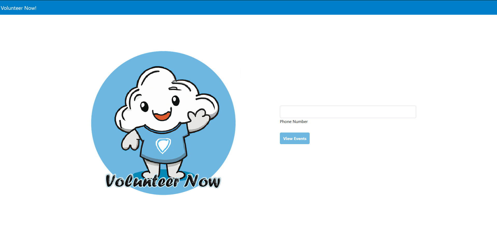
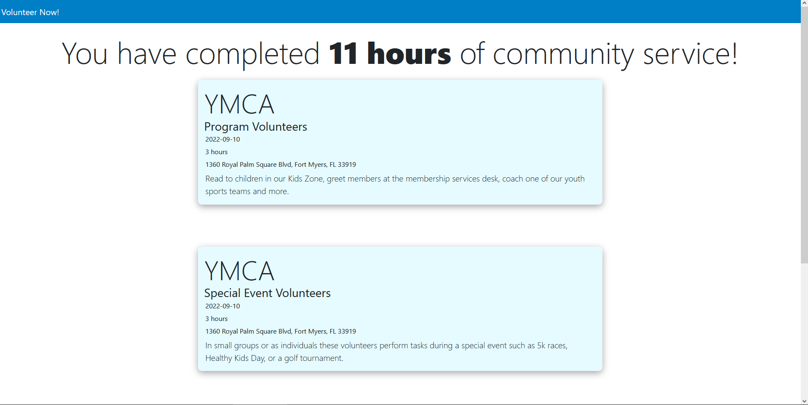

# Shellhacks-Repo
## [Requirement document](https://docs.google.com/document/d/1ux9aBeog7S1_dD89VTR_7BqGMgx6HApsiPTMT2WzUF4/edit) 
## IP address hosted from AWS EC2 instance: *http://18.118.32.177:8080/*
## Service Phone Number: *+1 332 900 5194*

# What is Volunteer Now?
A service that allows users to search and provide information for volunteer opportunities!

# Example

.png)
.png)

# Benefits
- Finding a wide variety of events
- Easy to find time availability
- Tracking down completed events
- Recommendations based on past events

## Inspiration
Hearing stories of students who struggle with getting volunteer hours and missing out on them.

## What it does
As it's hard to keep track of multiple events occurring constantly and missing out on them, Volunteer Now will put a stop to it. Events will be easier to keep in touch as well as seeing more options provided which will push for more volunteer opportunities.

## How we built it
- HTML/CSS: for frontend
- Python: for backend
- AWS: for cloud hosting

## Challenges we ran into
- Implementing AWS for the first time 
- Making a fully functional website
- Completing a full stack project within the given time frame
- Coming up with a feasible idea
- Buiding a database with SQLAlchemy
- 

## Accomplishments that we're proud of
- Learning Flask
- Multistack application for making 
- Updating and learning multiple device connection

## What we learned
- How to implement Flask
- Updating user interface elements

## What's next for VolunteerNow
- Having to add more features and allow more devices to cooperate with it
-
